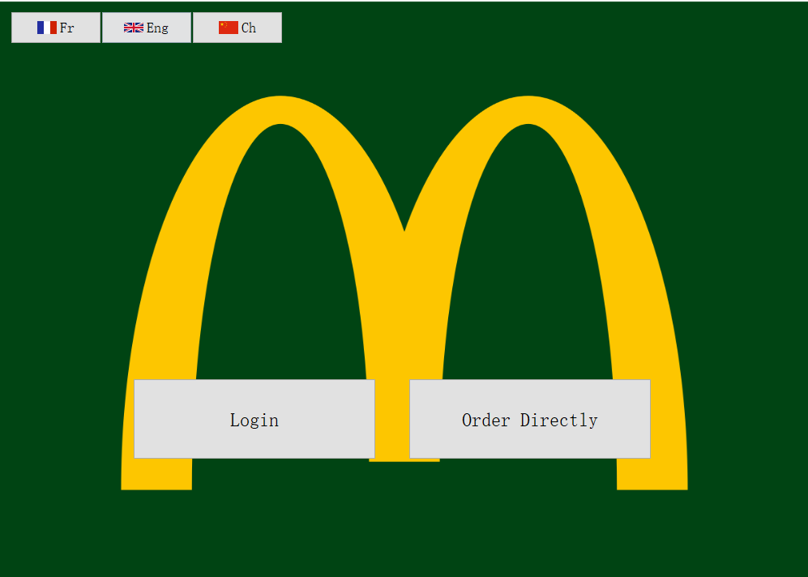
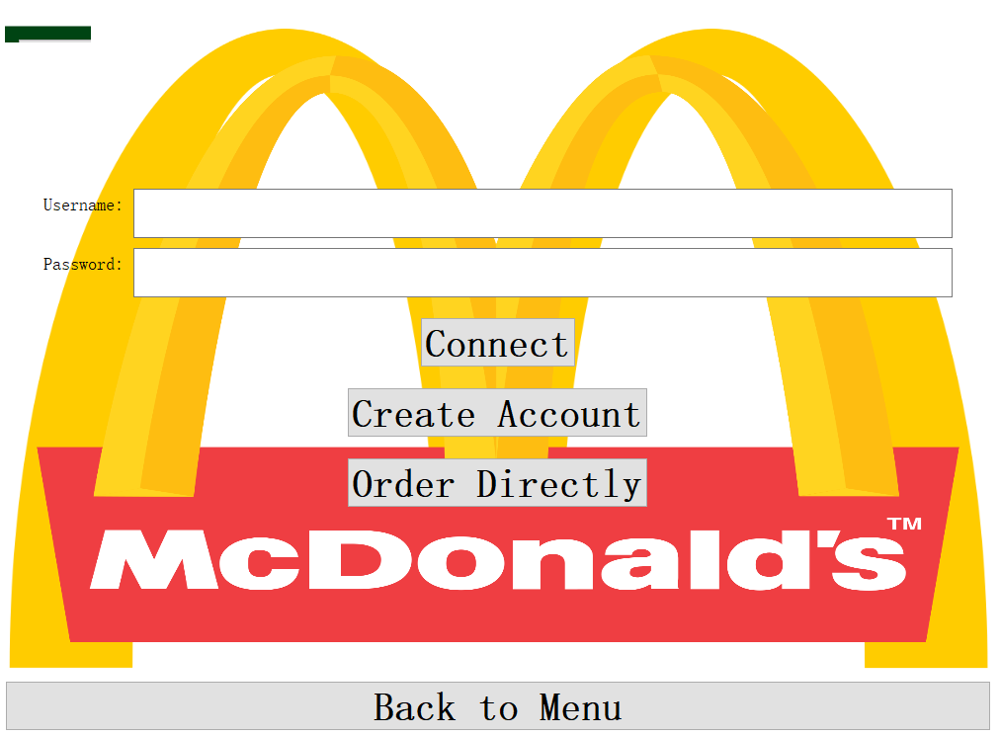
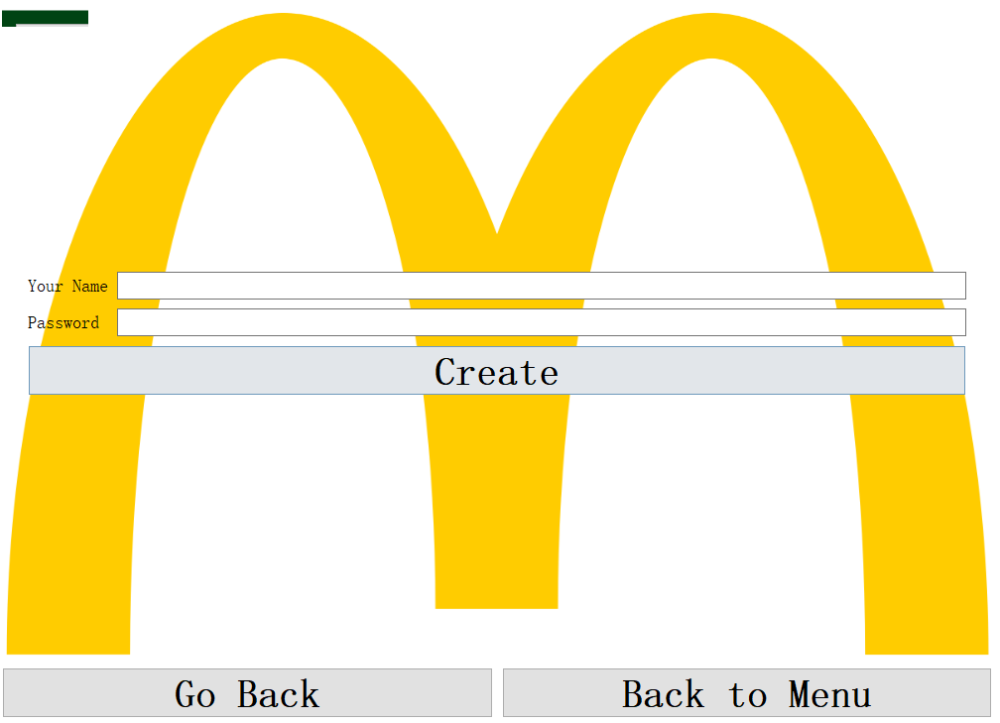
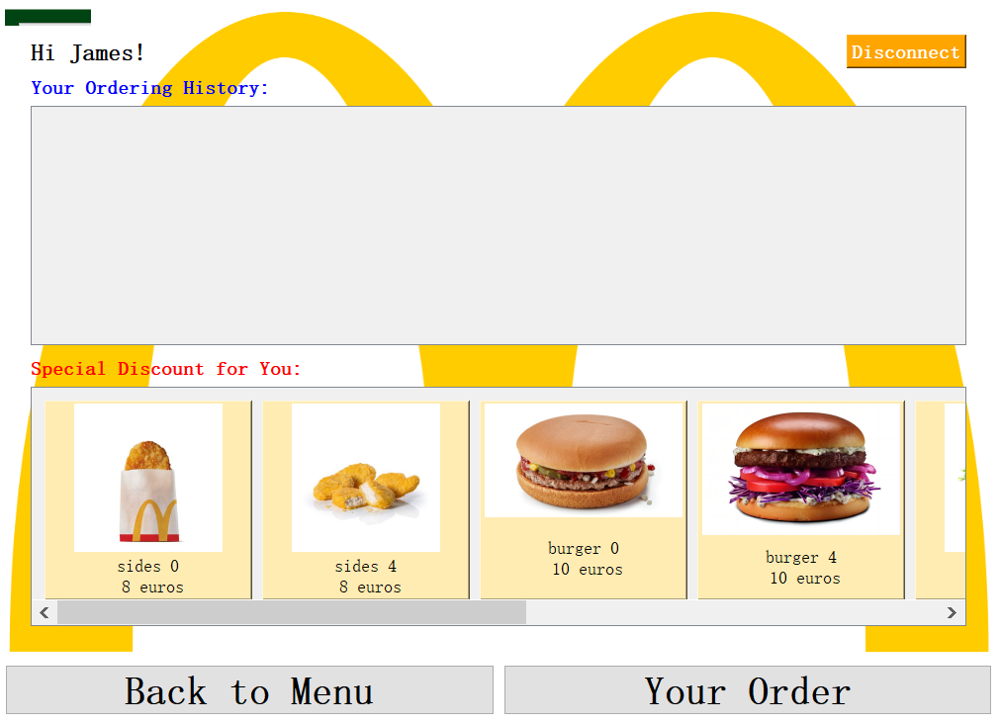
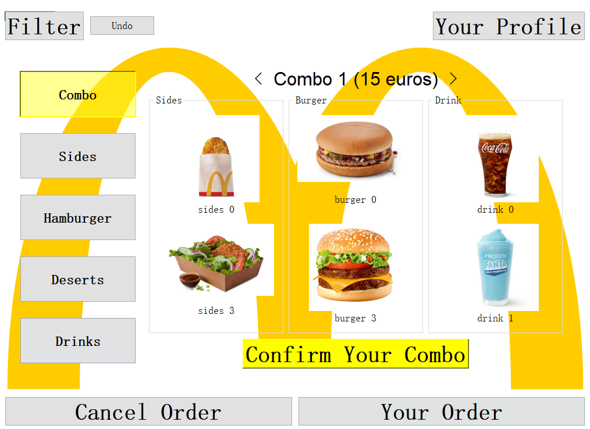
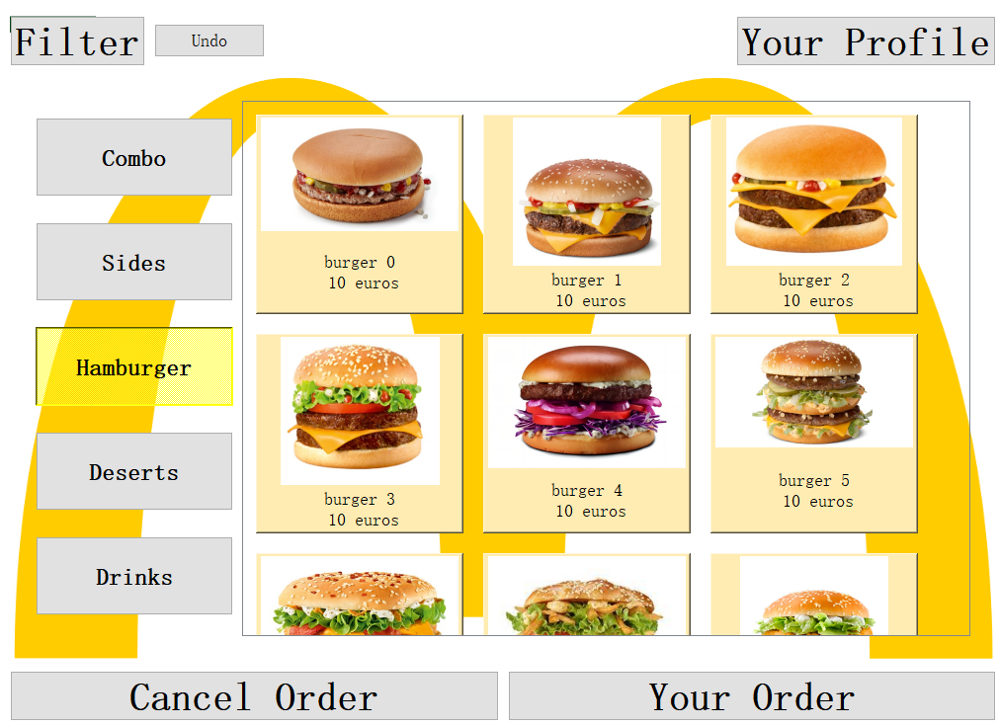
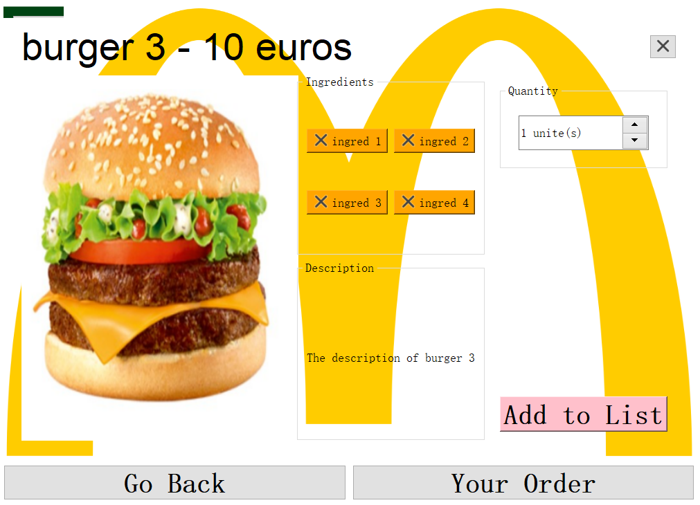
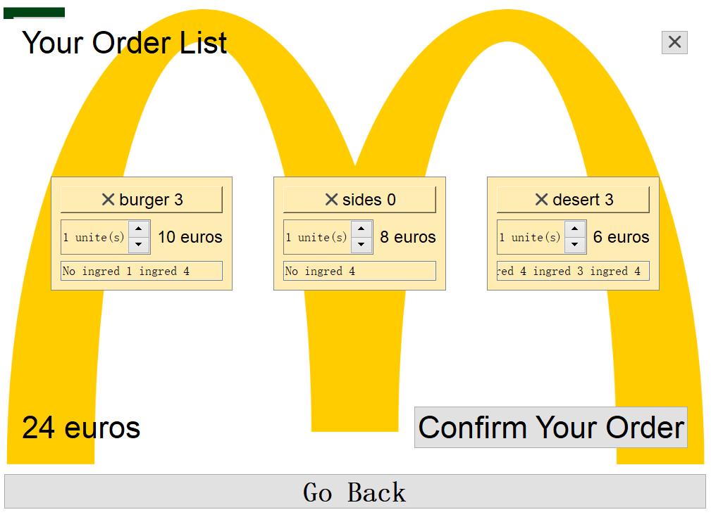
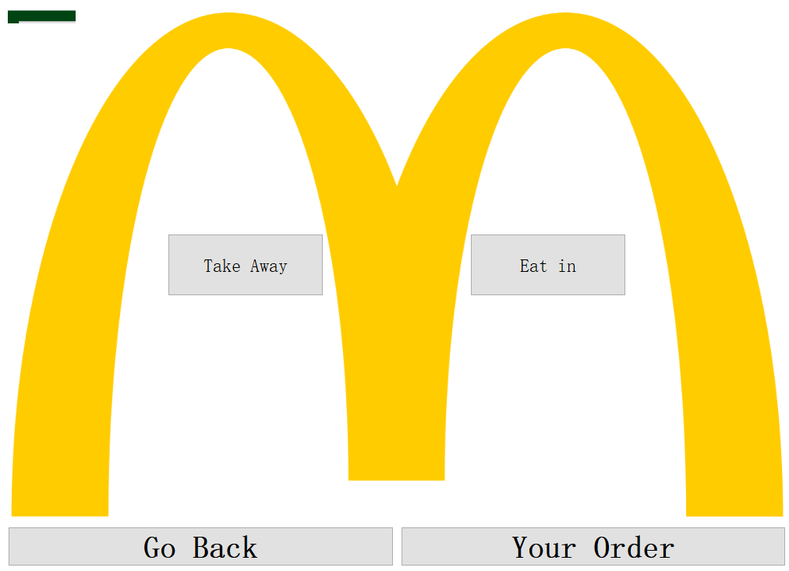
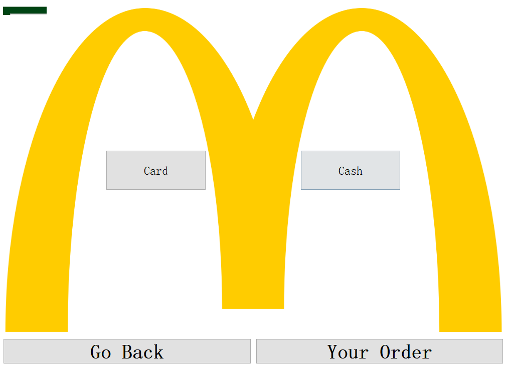

# IGR203 Interactive Restaurant Menu (McDonald)

## Introduction
This is the implementation of igr203 course project done by Group H. We implement an interactive restaurant menu using Qt. As tested, the code can run smoothly on Qt version 5 or 6.

## Guidance for The Interface
Here is guidance for the functionalities of our software prototype.

### Welcome Page

This is the welcome page, you could change the language setting on top left, and you could choose either login or order directly.

### Login Page

If you choose to login, you will see the page below.

You could either type in the user name and password to login (whatever the name and password would work), or you could create an account by clicking **Create Account**. You could also go back to order directly by clicking **Order Directly** or **Back to Menu**.

### Create Account Page

If you choose to create account, you will be directed to this page. You can either create account by typing name and password, or you could go back to login page or order directly by clicking the two bottom buttons.

### Connect to Account

Here is the profile page you will go after creating a new account (if you login, the order history will not be empty). You could click on items to add to order list and you could go back to the main menu by clicking **Back to Menu**. To see your order list, click **Your Order**. If you want to disconnect, click on the right top **Disconnect**.

### Main Menu Page

Here are the main menu pages. You could choose different combos (Choose different type on the top< >) and dishes. You could click on the dishes to the the details. You could click on **Cancel Order**  to cancel your order (a message box confirmation will appear). You could see your order list on **Your Order**. You could go to the profile page by clicking **Your Profile** (This allows you to login if you haven't logged in yet). You can click on **Filter** if you have special demands (vegetarian or allergic to some ingredients). The **Undo** button is to undo the filter process.

### Detail Page

If you click on the dish, this page will appear. It contains dish description. You could customize your choice by cancelling out some ingredients by clicking on **ingredi**. Note that this information will appear as additional information in your order list. You could raise the quantity in top right and add to list at bottom right.

### Filter Page

If we have special requirements (for example if you are vegetarian or you are allergic to something), you could go to filter page to filter out things. After finished, click **Confirm** to go back to main menu, and the menu will be filtered based on your requirement. The undo button in the main menu can reset the filter. If you don't want to filter anything, just click on **Go Back**.

### Order List Page

If you have chosen your products, you could go here to see your order list, you can see additional information on customization and the price. You could cancel dishes direcly by clicking x on the top of the dish. If you have finished your order, click **Confirm Your Order** to pay the bill. This button will lead to the following pages.

Then your ordering process is finished.